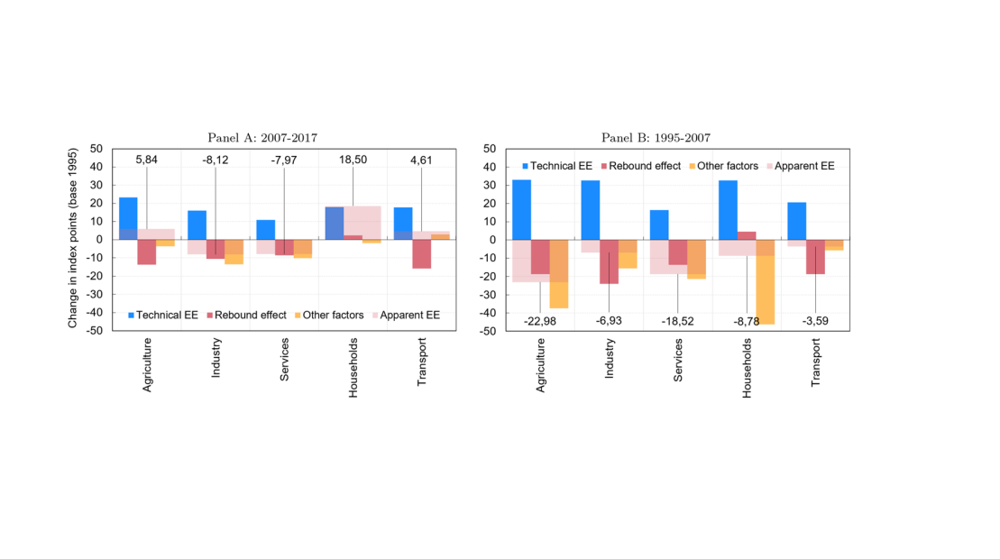

# Codes for "<i>[Are We Moving Toward An Energy-Efficient Low-Carbon Economy? An Input-Output LMDI Decomposition of CO2 Emissions for Spain and the EU28](https://link.springer.com/article/10.1007/s13209-020-00227-z)</i>"

These codes produce the results of the corresponding published article.



- Author: [Darío Serrano-Puente](https://serranopuente.eu/)
- Article published in: <i>SERIEs - Journal of the Spanish Economic Association</i>, vol. [12(2)](https://link.springer.com/journal/13209/volumes-and-issues/12-2), pp. 151-229 | Special issue on “The Economics of the Energy Transition” | Guest Editors: Natalia Fabra (UC3M) and Xavier Labandeira (UVigo)
- [Published Manuscript](https://serranopuente.eu/assets/docs/s13209-020-00227-z.pdf)
- [Original Draft](https://serranopuente.eu/assets/docs/20201205_Serrano_Puente_Dario_IO_LMDI_Energy_CO2_R1.pdf)
- [Slides](https://serranopuente.eu/assets/docs/20210211_Serrano_Puente_Dario_CO2_Emissions_Energy_Efficiency_Spain_EU28.pdf)
- [Google Scholar](https://scholar.google.com/scholar?hl=es&as_sdt=0%2C5&q=Are+We+Moving+Toward+An+Energy-Efficient+Low-Carbon+Economy%3F+An+Input-Output+LMDI+Decomposition+of+CO2+Emissions+for+Spain+and+the+EU28&btnG=)

## The Methodology
I develop a hybrid decomposition approach called input-output logarithmic mean Divisia index (IO-LMDI) decomposition method. With this methodological approach, we can provide an allocation diagram scheme for assigning the responsibility of primary energy requirements and carbon-dioxide emissions to the end-use sectors, including both economic and non-productive sectors. In addition, we analyze more potential influencing factors than those typically examined, we proceed in a way that reconciles energy intensity and energy efficiency metrics, and we are able to distinguish between technical and observed end-use energy efficiency taking into account potential rebound effects and other factors.

## </> Coding Languages

- Stata (100%)

## The File Structure

```matlab
% There are 20 ordered routines needed for the process in folder:
Codes
```

## [!] Data Disclaimer

The data I use in my work is open from Eurostat, ODYSSEE, and IPCC. Therefore, I do not provide here the data. Feel free to contact me if you need some guidance.

## Contact
If you want to contact me you can reach me [here](https://serranopuente.eu).

## License

2020 [Darío Serrano-Puente](https://serranopuente.eu) | This code is **open for the research community**. Please, cite my work accordingly.


